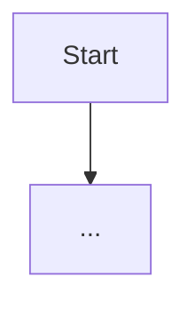

<!--
  PRD-Spec template (phase 2). Expands the APPROVED Intent into a full product spec.
  Stay consistent with forge/artifacts/01-intent.md (same vision, personas, scope, constraints);
  the phase-7 RTM will trace Intent features -> these US-xxx -> stories -> tests. Clarify, don't
  assume. Use ```mermaid fences for process flows and the rollout gantt — forge renders them to
  PNG and embeds them as Confluence attachments on publish. Mark uncertainties inline with
  [ASSUMPTION] and list them under Open Questions. {{...}} placeholders are filled by forge.
-->
# PRD-Spec

**Status:** {{status}}

**Artifact:** {{artifact_uuid}}

## Executive Summary

<2–4 paragraphs: what the product is, the business need, the first-release scope at a glance,
target users, and the primary measurable outcomes. Consistent with the Intent vision.>

## Business Objectives and Success Criteria

| Objective | How the Product Delivers | Success Criteria | Measurement Method |
|-----------|--------------------------|------------------|--------------------|
| <objective> | <capabilities that deliver it> | <quantified target> | <how it's measured> |

## Personas and Stakeholders

| Name | Type | Role | Goals | Pain Points | How Served |
|------|------|------|-------|-------------|------------|
| <name> | Persona\|Stakeholder | <role> | <goals> | <pain points> | <how the product serves them> |

## User Stories and Acceptance Criteria

<High-level product stories (US-xxx). These are decomposed into fine-grained Work Orders in the
phase-5 User Stories artifact; keep IDs stable.>

| ID | As a... | I want to... | So that... | Priority | Acceptance Criteria |
|----|---------|--------------|-----------|----------|---------------------|
| US-001 | <role> | <capability> | <benefit> | P0 | Given <context>, When <action>, Then <outcome>. |

## Business Process Overview

<For each key process: a short narrative, participants, business outcome, and a mermaid diagram.>

### <Process name>
<Narrative.> **Participants:** <...>. **Business outcome:** <...>.



## Business Rules and Policies

| Rule | When It Applies | User Experience | Example |
|------|-----------------|-----------------|---------|
| <rule> | <trigger> | <what the user sees/experiences> | <concrete example> |

## Success Metrics and KPIs

### Primary metrics
| Metric | Target | Measurement Method | Timeline | Business Impact |
|--------|--------|--------------------|----------|-----------------|
| <metric> | <target> | <method> | <when> | <impact> |

### Secondary metrics
| Metric | Target | Measurement Method | Timeline | Business Impact |
|--------|--------|--------------------|----------|-----------------|
| <metric> | <target> | <method> | <when> | <impact> |

### Guardrail metrics
| Metric | Target | Measurement Method | Timeline | Business Impact |
|--------|--------|--------------------|----------|-----------------|
| <metric> | <target> | <method> | <when> | <impact> |

## Risks, Assumptions, Dependencies, and Constraints

### Risks
| Risk | Likelihood | Impact | Mitigation | Owner |
|------|------------|--------|------------|-------|
| <risk> | Low\|Medium\|High | Low\|Medium\|High | <mitigation> | <owner> |

### Assumptions
| Assumption | Impact if Wrong | Validation Plan |
|------------|-----------------|-----------------|
| [ASSUMPTION] <assumption> | <impact> | <how it will be validated> |

### Dependencies
| System/Team | Dependency | Timeline | Impact if Delayed |
|-------------|------------|----------|-------------------|
| <system/team> | <dependency> | <when needed> | <impact> |

### Constraints
| Constraint | Type | Impact |
|------------|------|--------|
| <constraint> | technical\|regulatory\|business | <impact> |

## Scope, NFRs, and Open Questions

### In Scope
- <item>

### Out of Scope
- <item>

### Future Consideration
- <item>

### Non-Functional Requirements
- **Performance**: <targets>
- **Security**: <requirements>
- **Data Protection and Classification**: <PII/classification/retention>
- **Accessibility**: <e.g. WCAG 2.2 AA where applicable>
- **Scalability / Availability**: <targets>
- **Observability and Supportability**: <logs/metrics/health>

### Open Questions
1. **<owner/role>**: <question to resolve>

## Data Migration and Cutover Scope

<Whether/what data is migrated at go-live, or explicitly a clean start; cutover readiness focus.>

## Rollout Plan

1. **Phase 1 — <name>**
   **Timeline:** <start> to <end>
   **Description:** <...>
   **Key milestones and deliverables:** <...>
   **Success gates:** <...>
   **Owner:** <...>

```mermaid
gantt
  title <Product> Rollout
  dateFormat  YYYY-MM-DD
  section Delivery
  Phase 1 :a1, <start>, <end>
```

## Confidence

Overall: **{{confidence}}%**

> <one-line assessment, incl. coverage of the Intent's features/scope>

| Section | Score | Why | How to Improve |
| --- | --- | --- | --- |
| Intent alignment | <n>% | <covers Intent vision/features?> | <gaps> |
| Executive Summary | <n>% | <why> | <how> |
| User Stories & AC | <n>% | <why> | <how> |
| Success Metrics & KPIs | <n>% | <why> | <how> |
| Risks/Assumptions/Deps/Constraints | <n>% | <why> | <how> |
| Scope/NFRs/Open Questions | <n>% | <why> | <how> |

---

**Changelog** ({{iso_timestamp}}): PRD-Spec: <n> section(s) changed.

- **Created:** initial PRD-Spec for <project>
