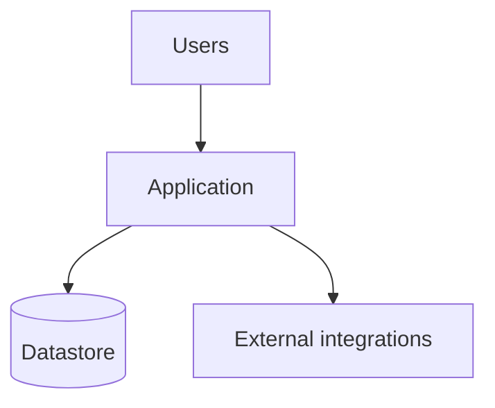
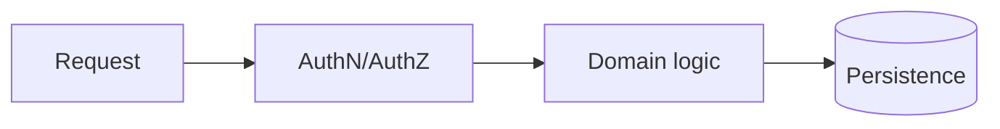
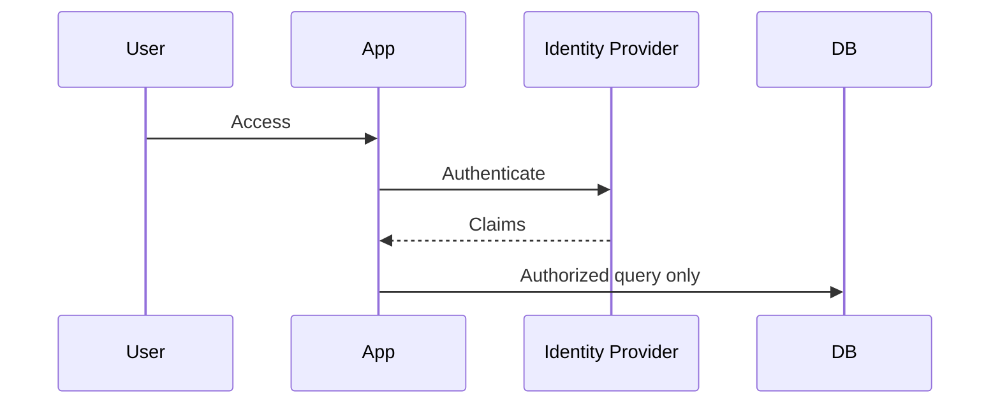
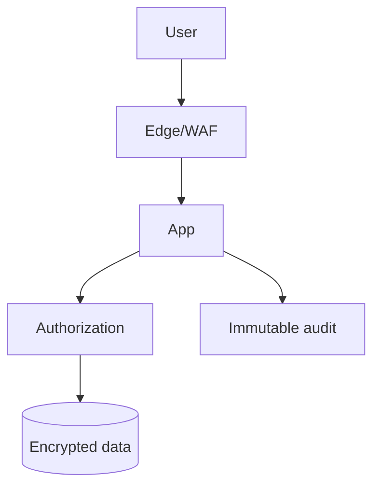
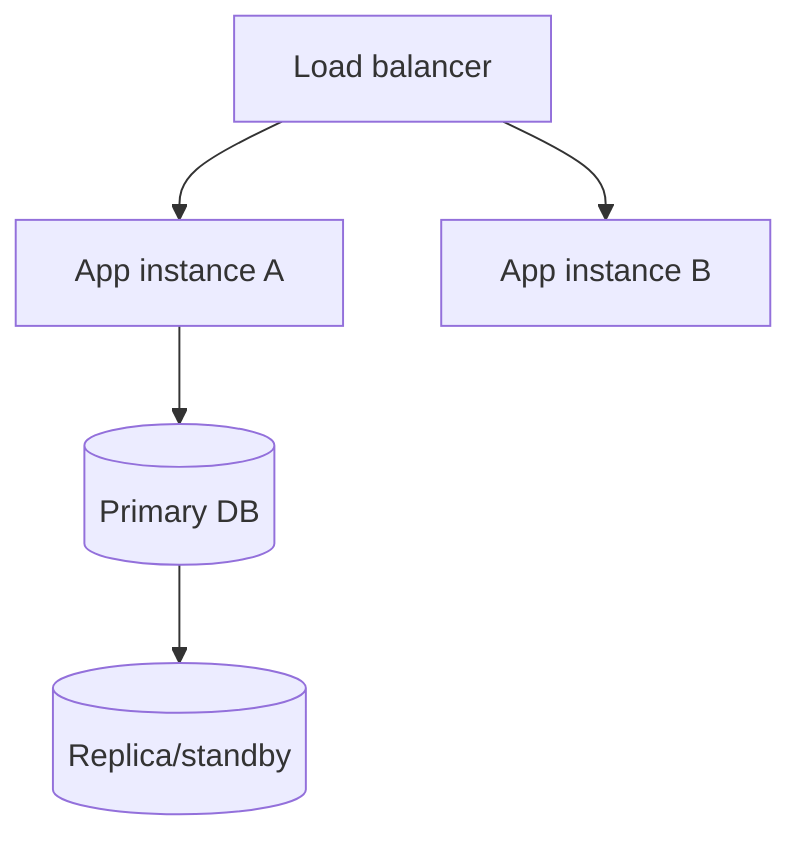
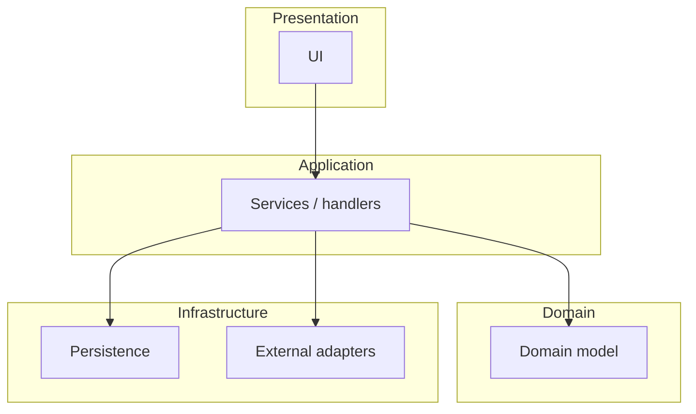
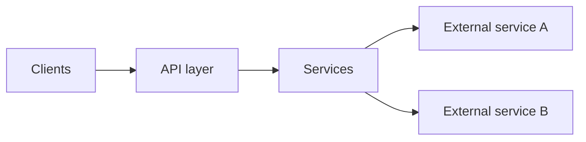
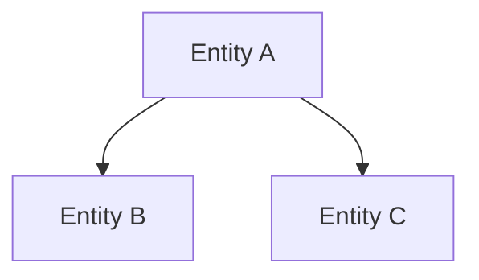
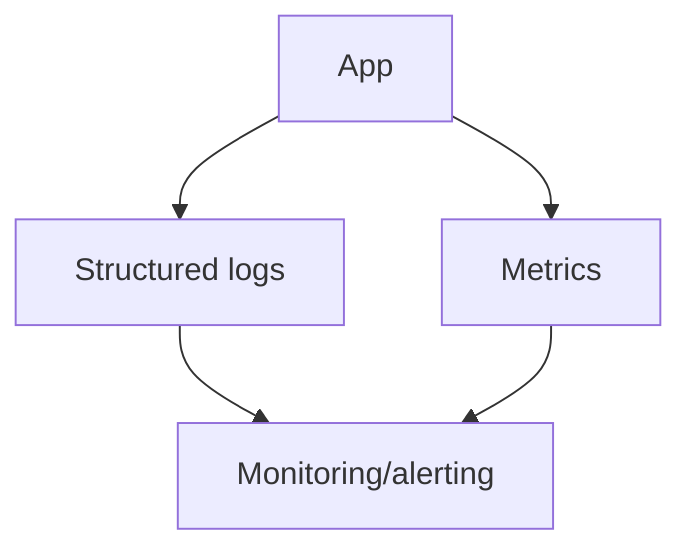

<!--
  Architecture template (phase 3). Builds on the APPROVED Intent + PRD-Spec. Stay consistent
  with them (same scope, personas, constraints, NFRs); the Confidence rubric must verify coverage
  of the Intent's core features and the PRD's rules/NFRs. FIXED clarify question for this phase:
  confirm/finalize the tech stack (Intent recorded a recommendation — do NOT silently assume it;
  confirm with the user). Use ```mermaid fences for every diagram section — forge renders them to
  PNG attachments on publish. {{...}} placeholders are filled by forge.
-->
# Architecture

**Status:** {{status}}

**Artifact:** {{artifact_uuid}}

## Architecture Executive Summary

### Project Context
<What is being built (from Intent/PRD), for whom, at what scale, and the success criteria the design must satisfy.>

### Architectural Philosophy
- <Guiding principle, e.g. simplest architecture that meets scale; security/PII as invariants; auditability in every write path.>

### Key Decisions
| Decision | Choice | Alternatives Considered | Rationale |
|---|---|---|---|
| <area, e.g. app style> | <chosen> | <alternatives> | <why> |

### Intent Alignment
<How the design maps to each Intent core feature and PRD objective. This drives the phase-7 RTM.>

## System Architecture Overview
<Target system shape, module/runtime boundaries, integration topology, failure modes.>



## Data Flow Diagram
<End-to-end request/data flow through the common command/query pipeline; where authorization + audit apply.>



## Authentication & Authorization Flow
<Authentication model, authorization model (roles/scopes), session/token controls, fail-closed behavior + audit.>



## Security Architecture
<Defense-in-depth, data classification, PII handling, crypto/secrets, logging/alerting, fail-closed rules.>



## Deployment Architecture
<Environments, hosting topology, scaling, rollout/rollback, evidence/gates. Cloud/on-prem per confirmed constraints.>



## Component Architecture
<Module/component breakdown, responsibilities, boundaries, coupling controls, background jobs.>



## API Integration Architecture
<Internal/external API boundaries, auth, payload/error conventions, external service adapters.>



## Database Schema Analysis
<Core entities, keys/relationships, segregation/scoping columns, indexing, transactions/retention. Greenfield: define the target schema.>



## Technology Stack Summary

<Confirm the stack with the user (Intent recorded a recommendation). Note versions assume current availability and must be reconciled with corporate standards.>

| Layer | Technology | Version | Status | Rationale |
|---|---|---:|---|---|
| <layer> | <tech> | <version> | modern\|acceptable\|legacy | <why> |

### Trade-Off Summary
<Key trade-offs of the chosen stack/architecture vs. alternatives.>

## Architectural Concerns & Recommendations

| # | Concern | Severity | Impact | Recommendation | Effort |
|---:|---|---|---|---|---|
| 1 | <concern> | Critical\|High\|Medium\|Low | <impact> | <recommendation> | S\|M\|L |

## Quality Attributes & NFR Matrix

| Attribute | Target | Current | Gap | Priority |
|---|---|---|---|---|
| Performance | <target> | New project | <gap/tests needed> | P0 |
| Security | <target> | New project | <gap> | P0 |
| Availability | <target> | New project | <gap> | P0 |
| Scalability | <target> | New project | <gap> | P0 |
| Auditability | <target> | New project | <gap> | P0 |

## Operational Architecture
<Observability (logs/metrics/traces/health), alerting, reliability/DR, runbooks.>



## Confidence

Overall: **{{confidence}}%**

> <one-line assessment incl. coverage of Intent features and PRD rules/NFRs>

| Section | Score | Why | How to Improve |
| --- | --- | --- | --- |
| Intent alignment | <n>% | <all core features covered by the design?> | <gaps> |
| PRD/NFR coverage | <n>% | <rules + NFR targets addressed?> | <gaps> |
| Security & data protection | <n>% | <why> | <how> |
| Deployment & operations | <n>% | <why> | <how> |
| Technology stack | <n>% | <confirmed vs recommended> | <confirm corporate standards> |
| Structural completeness | <n>% | <all required sections present?> | <how> |

---

**Changelog** ({{iso_timestamp}}): Architecture: <n> section(s) changed.

- **Created:** initial Architecture for <project>
